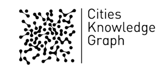

<p align="center"><a href="https://fcl.ethz.ch/research/research-projects/cities-knowledge-graph.html" target="_blank" rel="noopener noreferrer"></a></p>

# Cities Knowledge Graph

## Introduction 

This research aims to harness rapidly growing and diversifying data streams to improve the planning and design of cities. We have developed an innovative digital platform, 
known as the [Cities Knowledge Graph (CKG)](https://fcl.ethz.ch/research/research-projects/cities-knowledge-graph.html), designed to combine data and share knowledge about cities, and to inject new precision and responsiveness to static instruments of planning, 
such as the city master-plan. 

Cities Knowledge Graph platform is an augmented version of the [3D City Database](https://github.com/3dcitydb/3dcitydb) platform. 
The augmented [Importer/Exporter](https://github.com/3dcitydb/importer-exporter) is a Java based front-end and is extended to work with RDF-based graph database in addition to relational database. 
The example RDF-based database is called [Blazegraph](https://github.com/blazegraph), which is an ultra high-performance graph database supporting RDF and SPARQL APIs.
It allows for high-performance loading and extracting 3D city model data. 

Cities Knowledge Graph is an Intra-CREATE collaborative project under the urban systems theme. The project brings together expertise from Cambridge CARES (the Cambridge Centre for Advanced Research and Education in Singapore, established by the University of Cambridge) as the host institution of the project, and SEC (the Singapore-ETH Centre, established by ETH Zürich). The team is led by principal investigators from the University of Cambridge and ETH Zürich.

This research is supported by the National Research Foundation, Prime Minister’s Office, Singapore under its external pageCampus for Research Excellence and Technological Enterprise (CREATE) programme.


## Structure of project folder 

- **Augmented Importer/Exporter**: Folders starting with "impexp-" as part of CityImportAgent, contains the source code for importing city model in form of CityGML into DB and extract it in form of CityGML or KML for visualisation
- **Utils folder**: containing the python scripts which are responsible for importing semantic urban information into the DB. 
- **3dcitydb-web-map-1.9.0**: The tool comes with Graphical User Interface (GUI) with customized components for CKG demo 
- **agents folder**: containing the implementation of various agents including CityInformationAgent, CityImportAgent, CityExportAgent, etc. 
- **access_agent_setup**: containing the code for updating the routing path for access agent

## Deployment of the agents and GUI locally (On-premises)
The backend of the project is developed in Java and can be running locally inside of tomcat server. The frontend including Graphical user interface can be deployed locally within NodeJS server. 
For building and running, more details are referred to [here](https://github.com/cambridge-cares/CitiesKG/blob/233-dockerize-the-cia-agent/agents/README.md)


## Deployment of the project with docker
For deployment of the project into a new laptop, our researcher also create docker file which allows you to build docker image and run the container without any installation hassle. 
It allows you to test and try out our demo faster. For Windows OS, you would need to download Docker Desktop. For Linux OS, you can download Docker server. 

To spin up the dockers, you could run the following code in the main directory. The [docker-compose.yml](https://github.com/cambridge-cares/CitiesKG/blob/233-dockerize-the-cia-agent/docker-compose.yml) 
contains the definition of the containers / services:
```
docker-compose up 
```
After any changes in the code, you need to rebuild the docker image. Before rebuild, you need to remove the old image first: 
```
docker-compose up --build
```


## License

The 3D City Database Importer/Exporter is licensed under the [Apache License, Version 2.0](http://www.apache.org/licenses/LICENSE-2.0). See the `LICENSE` file for more details.

Note that releases of the software before version 3.3.0 continue to be licensed under GNU LGPL 3.0. To request a previous release of the 3D City Database Importer/Exporter under Apache License 2.0 create a GitHub issue.

## Latest release ##

The latest stable release of the 3D City Database Importer/Exporter is 4.2.3.

Download a Java-based executable installer for the software [here](https://github.com/3dcitydb/importer-exporter/releases/download/v4.2.3/3DCityDB-Importer-Exporter-4.2.3-Setup.jar). Previous
 releases are available from the [releases section](https://github.com/3dcitydb/importer-exporter/releases).

## System requirements ##

* Java JRE or JDK >= 1.8
* [3D City Database](https://github.com/3dcitydb/3dcitydb) on
  - Oracle DBMS >= 10G R2 with Spatial or Locator option
  - PostgreSQL DBMS >= 9.6 with PostGIS extension >= 2.3
  
The 3D City Database Importer/Exporter can be run on any platform providing appropriate Java support. 

## Documentation and literature ##

A complete and comprehensive documentation on the 3D City Database and the Importer/Exporter tool is available [online](https://3dcitydb-docs.readthedocs.io/en/release-v4.2.3/index.html).

An Open Access paper on the 3DCityDB has been published in the International Journal on Open Geospatial Data, Software and Standards 3 (5), 2018: 
[Z. Yao, C. Nagel, F. Kunde, G. Hudra, P. Willkomm, A. Donaubauer, T. Adolphi, T. H. Kolbe: 3DCityDB - a 3D geodatabase solution for the 
management, analysis, and visualization of semantic 3D city models based on CityGML](https://doi.org/10.1186/s40965-018-0046-7). 
Please use this reference when citing the 3DCityDB project.


## GDAL Library Java bindings ##

GDAL version: 3.4.0
Java bindings (https://gdal.org/api/java/index.html)
Java bindings for **Windows** (https://trac.osgeo.org/gdal/wiki/GdalOgrInJavaBuildInstructions)
1. Install the GDAL core components from this link: https://www.gisinternals.com/query.html?content=filelist&file=release-1916-x64-gdal-3-4-1-mapserver-7-6-4.zip
2. Change the environment variables:
3. Append to PATH  - C:\Program Files\GDALGDAL_DATA - C:\Program Files\GDAL\gdal-data
   GDAL_DRIVER_PATH  - C:\Program Files\GDAL\gdalplugins
   PROJ_LIB: C:\Program Files\GDAL\projlib
   Change PROJ_LIB to the corresponding GDAL folder
4. Test to see if GDAL is installed by opening Command Prompt and type in:   gdalinfo --version
5. Copy and paste the following dlls from C:\Program Files\GDAL into your Java
     JDK bin folder (example: C:\Program Files\Java\jdk1.8.0_171\bin)
     In some version, if you don’t find <gdalalljni.dll>, you could copy and paste the following dlls
     gdalconstjni.dll
     gdaljni.dll
     ogrjni.dll
     osrjni.dll
6. Add the gdal java binding into the configuration file of your program.

